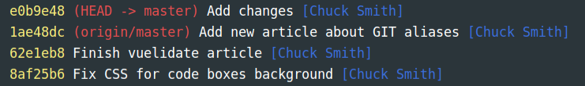
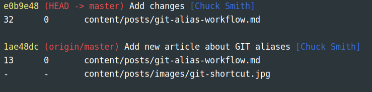

Continuing this article series about Streamlining Workflow, must include a way to streamline our git commands. This article uses my own aliases and a GIST for the full list.

TLTR: Want to just straight to the code? The complete alias file I use is available in this [GIST](https://gist.github.com/eclectic-coding/7510cf0771cae53f021f938549f027dc).

## Alias possibilities
There are a few ways to add aliases to your system and the natural place to start is by adding them to your terminal configuration. In my case, I have a ton of aliases I have added to my `.zshrc` workflow.

However, since these are Git commands I have decided to add them to my `.gitconfig` file. This makes sure my `zshrc` more DRY. To do this add a new section to your `.config` titled `[alias]`. Now, let's begin.

## My configuration
I am not going to go over every aliased command in my configuration, just the ones I use most frequently.

**Branches**

I have several commands that help with branches.Each command is prefixed with `git`.

- So, to checkout an existing branch: `git co name-of-branch`
- Create a new branch: `git cob name-of-new-branch`
- Create a new branch: `git br name-of-new-branch`. This alias I have stopped using in favor of `cob` because at creation, `cob` changes to the branch.
- Change to master branch: `git com`. If you have changed your default branch to `main` or some other name, this will still change to the default branch.
- Delete a branch: `git brd name-of-new-branch`

**Commits**

So, to check the status: `git st`, which uses the `-sb` switch to trim the CLI to a cleaner output:
```shell script
## master...origin/master
 M content/posts/git-alias-workflow.md
```
- Add all changed files: `git aa` instead of `git add -A`
- Commit: `git cm` This will open your editor of choice, or you can `git cm -m "My commit message"`
- Okay so my most used alias: `git aacm` is an alias for `git add -A && git commit`. Remember you will need to use the `-m` to add a message.

**Remote**

This alias is for a combined push with the remote repository:
- Combined add, commit, and push: `git acp`, using your editor, or suffix with `-m "Commit message"

Your remote:
- Push after you have done your commit: `git po`, as a short alias for `git push origin
- Pull from your remote branch: `git plo` as an alias for `git pull origin`

Working with an upstream
- Fetch: `git `fm` instead of `git fetch upstream`
- Merge upstream with main branch: `git mup` as an alis for `git merge upstream/master`

**logs**

I have a few aliases for `git log`

Pretty format, with decorate is `git ls`:


Pretty format, with decorate and `--numstat` is `git ll`:


These are my basic aliases that I use the most. Again, refer to the [GIST]() for a complete list.


