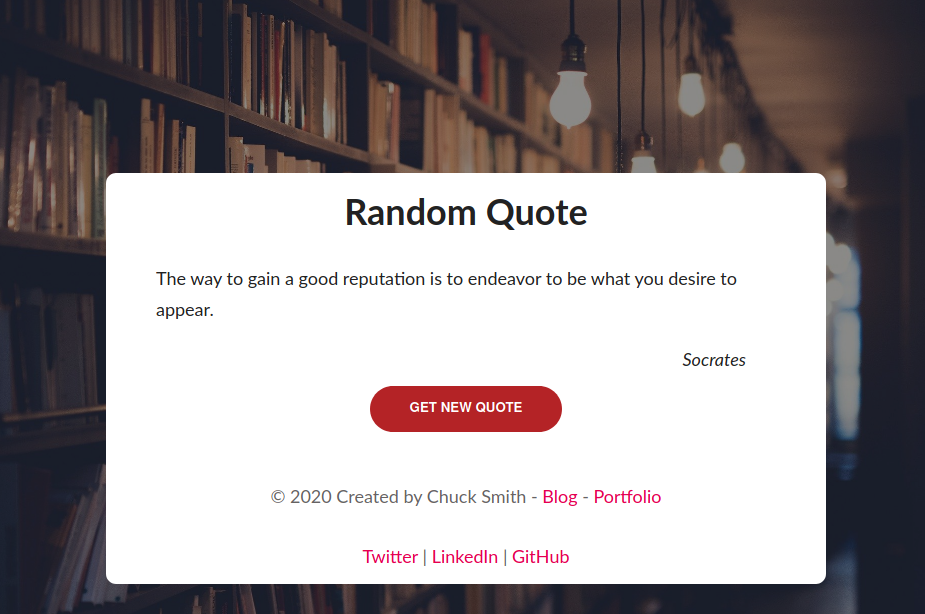

Since graduating from [Flatiron School][Flatiron] in March, I have been building a lot of projects, learning more technologies, and try to sharpen my skills as I search for my first professional Software Development position. Over the last few weeks I have been developing a Full-Stack Ruby on Rails application, called [Your Congress][Congress] which will become quite a large project. I decided to briefly stop on this project and try something different - **One Feature Three Projects**.

## Feature
So, I setup to work with one feature - to consume a Free API to display on a web site. This feature would load content as the site loads and could request more data at the users request. I selected a Free API that provides Random Quotes. This is a feature that is fairly common, but instead of one project, I have built out this project with three frameworks/libraries:

- HTML & Vanilla JavaScript
- React
- Vue.js

All of these options are simple projects, with no routing, just a single page. I will offer observations and my opinions in the conclusion.

## Vanilla JavaScript
I developed my first HTML site for my small business in 1998, so this project was like visiting an old friend. I took care to structure semantic HTML structure.

Loading the quotes is fairly straight forward with Vanilla JS, but it is important to think through the structure so as to not duplicate code. So, the function used to request the data should be reusable.

The main function, `getQuote()` (like the clever name?), uses `async/await` to fetch from the API. The returned data is a a random quote in a JSON object with three field: quoteText, quoteAuthor, and quoteGenre, which I am not using. So, injecting the data into the site from a successfully resolved request is done easily on the site render. The same function is used in an `addEventLister` with a click event on a button so the user can request a new quote.

```javascript
const quote = document.querySelector('#quote')
const author = document.querySelector('#author')
const getMore = document.querySelector('#get-quote')

async function getQuote() {
  let resp = await fetch('https://quote-garden.herokuapp.com/api/v2/quotes/random')

  if (!resp.ok) {
      throw new Error(`HTTP error! status: ${resp.status}`)
  } else {
    let data = await resp.json()
    quote.textContent = data.quote.quoteText
    author.textContent = data.quote.quoteAuthor
  }
}

getQuote()
getMore.addEventListener('click', getQuote, false)
```
I have also added a polyfill to add support for Fetch and Promise for older browsers.

**Styling**: If you have read my previous Blog posts, you know that I am partial to stying via SCSS, specifically my own SCSS Boilerplate. It took longer to develop this styling than the actual JS code, but it was portable to each project. It is compiled with Parcel.

This is the result (all three projects look the same):



[Vanilla JavaScript Code][HTML-Quote]

[Site Demo][HTML-repo]

## React
React has a special place in my heart. It was my curiosity of React that enticed me to attend {Flatiron][Flatiron] and pursue a future tech career. Approaching this project with React was fun. I decided to use Hooks and even though I could have abstracted out the code into a few components, I decided to keep the code in `App.js`. Notice in the code below, I am setting up state for loading indicators, errors, and data. The `async` fetch function, when the response is successful, sets the state accordingly. The React Hook `useEffect` performs the DOM updates.

```javascript
function App() {
  const [isLoading, setIsLoading] = React.useState(true)
  const [error, setError] = React.useState(false)
  const [data, setData] = React.useState({ quote: [] })

  async function fetchData() {
    const response = await fetch(
      'https://quote-garden.herokuapp.com/api/v2/quotes/random'
    )
    response
      .json()
      .then((response) => {
        setData(response)
        setIsLoading(true)
        setError(false)
      })
      .catch(() => {
        setIsLoading(false)
        setError(true)
      })
  }

  React.useEffect(() => {
    fetchData()
  }, [])
```
Since the `data` state is set, it is just a matter injecting the data. Overall, this is not much different than the Vanilla JS project. Notice that because we used one function we can use the same function as a click event to render a new quote.

```jsx harmony
<div className="card__quote">{data.quote.quoteText}</div>
  <div className="card__author">{data.quote.quoteAuthor}</div>
    <div className="card__button">
      <button className="btn btn__primary" onClick={fetchData}>
        Get Quote
      </button>
    </div>
```

[React Code][React-Quote]

[Site Demo][React-repo]

## Vue.js
I have been exploring the Vue.js eco-system over the last several months and find it a joy. I have developed with Vue.js, Nuxt_js, and my current blog uses Gridsome, a Vue.js derivative that utilized GraphQL.

I decided to create two components, keeping with the recommendations of the Vue.js Style Guide. The first component was to abstract the API service. I created a new directory: `src/services` and created a file `QuoteServices.js`.

Even though I used fetch in the other two projects, `axios` is such a part of the Vue.js eco-system, I decided to stay within those lines. We have an `apiClient` and a method `getQuote` we can use within our Home component:

```javascript
import axios from 'axios';

const apiClient = axios.create({
  baseURL: "",
  headers: {
    Accept: 'application/json',
    'Content-Type': 'application/json'
  }
});

export default {
  getQuote() {
    return apiClient.get('https://quote-garden.herokuapp.com/api/v2/quotes/random');
  }
};
```
The `Home.vue` is a new component. Each `vue` file is separated into three sections: template, script, and styles. This takes so getting use to but actually it can make a clean file.

Let's look at the `script` section. To consume our API, remember to have to load on render and has to rerender at the users request. So, we need to set up a data container and a method.

**Notes**:
- Import our `QuoteService`
- Set data container as `quoteData` that the API data will be stored
- In our method notice we are using the method we created in the QuoteService. We will use this on the click event.
- `created` is one of the Vue.js component lifecycles and we are using the method to load a quote on render

```javascript
<script>
import QuoteService from "../services/QuoteService";

export default {
  name: "Home",
  data() {
    return {
      quoteData: [],
    };
  },
  methods: {
    newQuote: function () {
      QuoteService.getQuote()
        .then((response) => {
          this.quoteData = response.data.quote;
        })
        .catch((error) => {
          console.log("These was an error:" + error);
        });
    },
  },
  created() {
    this.newQuote();
  },
};
</script>
```
So, let's look at the HTML structure. Most of this looks very similar. Vue.js uses `{{ }}` insert commands. It looks different than React at the `button` tag. The `v-on` is a Vue.js directive that listens to an event, in this case, a click event and then execute the method to call the API for new data.
```html
<div class="card__quote">{{ quoteData.quoteText }}</div>
  <div class="card__author">{{ quoteData.quoteAuthor }}</div>
    <div class="card__button">
    <button v-on:click="newQuote" class="btn btn__primary">
      Get Quote
    </button>
```
[Vuejs Code][Vuejs-Quote]

[Site Demo][Vuejs-repo]

## Conclusion
You have seen three distinct system, which in the end, have a lot of similarities. In the end, we have three web sites, that are exactly the same.

*What is the best?* Enter my **opinion** zone.
I think as developers, we spend too much time with this question. In my **opinion**, these are three separate tools for our tool chest. These are tools that we can examine and pick the right one for the project at hand. For this simple one page one feature project, the best tool, in my opinion might be the Vanilla JS project, but that is subjective.

## Footnote
This has been fun. Next week I am getting back on my Rails project. Leave a comment or send me a DM on Twitter.

**Shameless Plug**: If you work at a great company and you are in the market for a Junior Developer with a varied skillset and life  experiences, send me a message and check out my [LinkedIn](https://www.linkedin.com/in/dev-chuck-smith/).


[Flatiron]: https://flatironschool.com
[Congress]: https://yourcongress.co
[HTML-Quote]: https://random-quotes-api.eclectic-coding.vercel.app/
[HTML-repo]: https://github.com/eclectic-coding/html-random-quotes
[React-Quote]: https://cra-quote.eclectic-coding.vercel.app/
[React-repo]: https://github.com/eclectic-coding/react-random-quote
[Vuejs-Quote]: https://vue-random-quote.vercel.app/
[Vuejs-repo]: https://github.com/eclectic-coding/vue-random-quote
