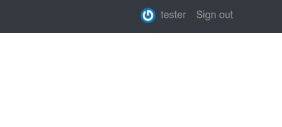

In the previous article in this series, we learned about Active Storage. We set up an interface to allow a user to add an Avatar to their user profile. Part Two of this two part series, we extend this feature to use, as a fallback image, the Gravatar service.

The goal is to check is the user has an attached image. If they do not, then fall back to the image from the [Gravatar](https://en.gravatar.com/) service. According to the Gravatar website:

> Your Gravatar is an image that follows you from site to site appearing beside your name when you do things like comment or post on a blog

What is interesting is that if the user has not provided an Avatar image for their profile at Gravatar, then it defaults to a standard image. So, essential it creates redundancy in our case.

TL;TR:  The completed repository if you would like to jump straight to the [code](https://github.com/eclectic-coding/article_active_storage).

## Helper method
So, we need to create a helper that we will locate in `app/helpers/application_helpers.rb`:
```ruby
def avatar_url_for(user, opts = {})
    size = opts[:size || 32]

    if user.avatar.attached?
      user.avatar.variant(
        resize: "#{size}x#{size}!"
      )
    else
      hash = Digest::MD5.hexdigest(user.email.downcase)
      "https://secure.gravatar.com/avatar/#{hash}.png?s=#{size}"
    end
 end
 ```
the method accepts two arguments, the user and an optional option hash. This hash is where we control the image size, which defaults to 32px. The conditional logic checks for the attached avatar, uses a user selected avatar or reverts to a Gravatar, and resizes based on the options array.

## Navbar
Active Storage

In the previous article we checked for the user's avatar like so:
```ruby
<li class="nav-item">
    <%= link_to user_path(current_user.username), class: "nav-link" do %>
      <% if current_user.avatar.nil? %>
        <%= image_tag current_user.avatar.variant(resize: "24x24!"), class: "mr-1" %>
      <% end %>
      <%= current_user.username %>
    <% end %>
</li>
```
We can edit this code to use our helper, which includes the logic to check for an avatar. This DRY's out our view file:
```ruby
<li class="nav-item">
    <%= link_to user_path(current_user.username), class: "nav-link" do %>
      <%= image_tag avatar_url_for(current_user, size: 24), class: "rounded-circle mr-1" %>
      <%= current_user.username %>
    <% end %>
</li>
```
So, if the user hasn't setup an avatar on Gravatar or their user profile the fallback image is used:


## Edit profile

We need to update the `edit.html.erb` file to use the helper logic. Take a look at the complete [source](https://github.com/eclectic-coding/article_rails_gravatar/blob/main/app/views/devise/registrations/edit.html.erb) for this file:

```html
<div class="row">
    <div class="col-sm-2">
      <%= image_tag avatar_url_for(current_user, size: 128), class: "rounded-circle m-4" %>
    </div>
    <div class="col-sm-10">
      <div class="form-group">
        <%= f.label :avatar %>
        <%= f.file_field :avatar %>
      </div>
    </div>
  </div>
```

## Show profile

Finally, we need to update the `edit.html.erb` file to use the helper logic:

```html
<div class="d-flex align-items-center justify-content-center mt-5">
  <div class="media mr-5 align-self-start">
    <%= image_tag avatar_url_for(current_user, size: 128), class: "rounded-circle mr-4" %>
  </div>
  <div class="media">
    <div class="media-body">
      <div class="d-flex flex-row align-items-center justify-content-between">
        <h1><%= @user.username %></h1>
        <%= link_to "Edit", edit_user_registration_path, class: "ml-3 btn btn-secondary btn-sm" if current_user.id == @user.id %>

      </div>
    </div>
  </div>
</div>
```


## Footnote

This has been fun. Leave a comment or send me a DM on [Twitter](http://twitter.com/EclecticCoding).

Shameless Plug: If you work at a great company and you are in the market for a Software Developer with a varied skill set and life experiences, send me a message on [Twitter](http://twitter.com/EclecticCoding) and check out my [LinkedIn](http://www.linkedin.com/in/dev-chuck-smith).
