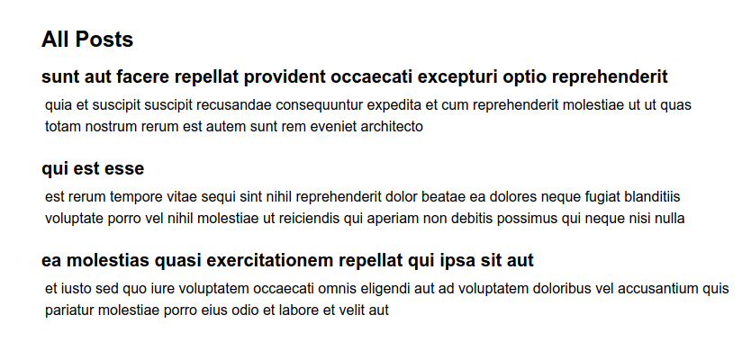
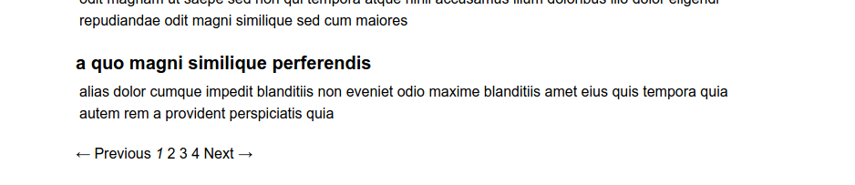
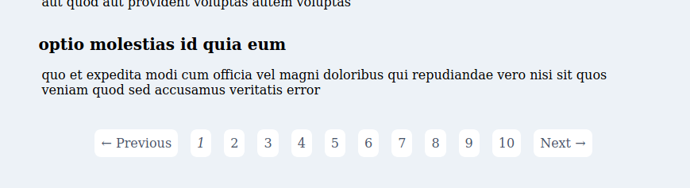

Adding pagination to any web site can be a challenge. Luckily, there are a few ways to accomplish this is Rails. This article will add pagination to a simple post and then we will configure Tailwind for styling to pagination block.

TLTR: You can go view the code at the [repository](https://github.com/eclectic-coding/article-pagination-tailwindcss).

## Setup

So, I have created a fairly basic Rails application using the basic defaults. I scaffold out a Post resource: `rails g scaffold Post`.

As mentioned I have set up TailwindCSS for styling. This is not a Tailwind CSS tutorial, per se, but if you need help installing and configuring Tailwind in a Rails 6 application, [Tuna Çağlar Gümüş](https://dev.to/tcgumus) has written a wonderful [tutorial](https://dev.to/tcgumus/how-to-install-tailwind-css-on-rails-6-0-2h3f) for this purpose. I have included basic styling to get started as seen here in the following `application.html.erb`:

```html
<!DOCTYPE html>
<html lang="en" class="h-full">
<head>
  <title>ArticlePagination</title>
  <%= csrf_meta_tags %>
  <%= csp_meta_tag %>

  <%= javascript_pack_tag 'application' %>
  <%= stylesheet_pack_tag 'stylesheets' %>
</head>

<body class="flex flex-col h-full bg-gray-200">
<main class="container mx-auto m-8 flex-1">
  <%= yield %>
</main>

</body>
</html>
```

To get a post feed setup I have setup posts from JSONplaceholder in the following way:

Install [Faraday](https://github.com/lostisland/faraday) to make the HTTP requests to **JSONPlaceholder**. Either `bundle add faraday` or add to your Gemfile: `gem 'faraday'` and then `bundle install`. Add the following to the `db/seed.rb` file:

```ruby
@response = Faraday.get 'https://jsonplaceholder.typicode.com/posts'
post_data = JSON.parse(@response.body)

post_data.each do |post|
  Post.create!(
    content: post['body'],
    title: post['title']
  )
end
```
Then seed the database: `rails db:seed`.

The post index page is setup like so with the appropriate styling:

```html
<p id="notice"><%= notice %></p>

<h1 class="text-2xl font-semibold my-2">All Posts</h1>

<% @posts.each do |post| %>
  <h2 class="text-xl font-semibold"><%= post.title %></h2>
  <p class="m-1 pb-4"><%= post.content %></p>
<% end %>

<div class="mx-auto text-center my-4">
  <%= will_paginate @posts %>
</div>
<br>
```
This is how our post feed appears now:



## Pagination

Pagination in Rails can be fairly easy with the help of a gem called [will_paginate](). With this gem, it takes literally two lines of additional code. To get started, install the gem: `bundle add will_paginate`.

In your Post ERB for the index view, place where you want your pagination to appear: `<%= will_paginate @posts %>`. Your `index.html.erb` should like like this:

```erb
<h1 class="text-2xl font-semibold my-2">All Posts</h1>

<% @posts.each do |post| %>
  <h2 class="text-xl font-semibold"><%= post.title %></h2>
  <p class="m-1 pb-4"><%= post.content %></p>
<% end %>

<%= will_paginate @posts %>

```

Add the following to the Post controller's index method:

```ruby
def index
    @posts = Post.paginate(page: params[:page])
end
```

The pagination defaults to 30 items and you will probably want to adjust the `per_page` maximum. Back in the controller file, tweak the index method to the following:

```ruby
def index
    @posts = Post.paginate(page: params[:page], per_page: 10)
end
```
You now have a working pagination, however, it is not styled:



## Styling Pagination

There are gem's which will style `will_paginate`, for instance, if you use Bootstrap there are a few gem's that can quickly add styling for the pagination, but I have yet to find one for Tailwind CSS. This seems like a good future project ... hmm?

So, we will have to add the styling ourselves and fortunately `will_paginate` does add structured HTML code that already has classes in which we can target.

```html
<div role="navigation" aria-label="Pagination" class="pagination">
  <span class="previous_page disabled">← Previous</span> 
  <em class="current" aria-label="Page 1" aria-current="page">1</em> 
  <a rel="next" aria-label="Page 2" href="/posts?page=2">2</a> 
  <a aria-label="Page 3" href="/posts?page=3">3</a> 
  <a aria-label="Page 4" href="/posts?page=4">4</a> 
  <a class="next_page" rel="next" href="/posts?page=2">Next →</a>
</div>
```

So the first addition we add is to add a `div` wrapper that can target to center the pagination block:
```html
<div class="text-center my-4">
    <div role="navigation" aria-label="Pagination" class="pagination">
      <span class="previous_page disabled">← Previous</span> 
      <em class="current" aria-label="Page 1" aria-current="page">1</em> 
      <a rel="next" aria-label="Page 2" href="/posts?page=2">2</a> 
      <a aria-label="Page 3" href="/posts?page=3">3</a> 
      <a aria-label="Page 4" href="/posts?page=4">4</a> 
      <a class="next_page" rel="next" href="/posts?page=2">Next →</a>
    </div>
</div>
```

We will add the new styling to the `app/javascript/css/application.scss` stylesheet and will start with the `pagination` class.

```scss
@import "~tailwindcss/base";
@import "~tailwindcss/components";

.pagination {
  @apply flex justify-center;
  @apply my-2 py-2;
}

@import "~tailwindcss/utilities"; 
```
FYI. Make sure you add your custom styling between the `tailwindcss/components` and `utilities`.

Then we need to target each child element of the parent `pagination` class:

```scss
.pagination * {
  @apply px-3 py-2 mx-2;
  @apply text-gray-700 no-underline bg-white rounded-lg;
}
```
Now finally we add the hover styling:
```scss
.pagination a:hover {
  @apply font-semibold text-gray-200 bg-gray-700;
}
```

Now you have a nice pagination block styled with Tailwind CSS:



Thank you for reading and message me with any question you may have.
