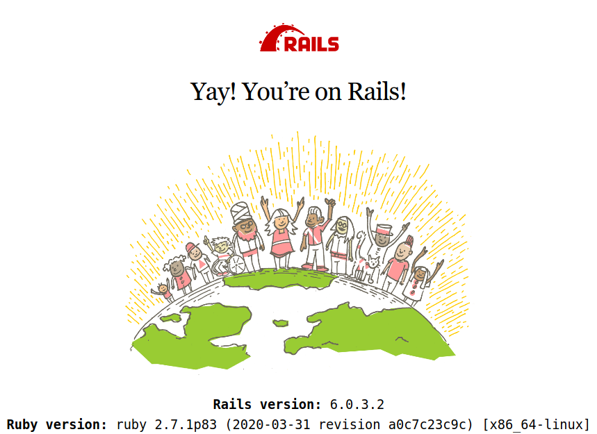
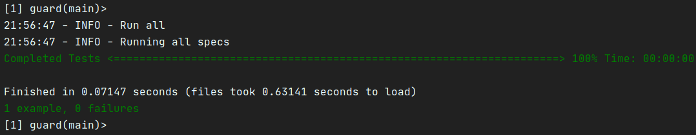
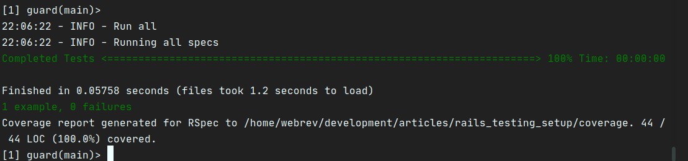

How do you setup a Rails project for testing? In this article we will explore what a testing suite, using RSpec and other tools, for a robust developers experience. This article touches on my approaches to testing tools as I have been focused on learning RSpec.

TLTR: Hey, just go grab the [code][REPO]

## Basic project setup.
First we need to start a rails project. We will use the `-T` switch to exclude testing since we will opt for RSpec over the Rails default of `minitest`. We will also default to Postgres for our database. This is not required, just my preference:
```
rails new rails_testing_setup -T --database=postgresql
```
Create and migrate the databases.
```
rails db:prepare && rails db:migrate
```
You can start the `rails server` and see the familiar Rails splash screen.


## Basic Testing
To set up testing we are going to use RSpec, which according to the RSpec web site: "*Behaviour Driven Development for Ruby. Making TDD Productive and Fun.*" I am not sure about all of that, but it is what we are setting u0p.

**Basic Rspec setup**

We will add two gems to your `Gemfile` in the development and test group, RSpec and Capybara, which helps you test web applications by simulating how a real user would interact with your app.:
```
group :development, :test do
  ...
  gem "capybara", ">= 2.15"
  gem "rspec-rails"
  ...
end
```
If by chance, you forgot to exclude the testing framework on the rails setup, make sure you delete the `test` directory. It doesn't hurt anything, but it is a best practice not to include two testing directories. Then setup RSpec: `rails g rspec:install`. This will install a `spec` directory with a couple of helper files.

Now, we need to clean up and add some configuration to the `rails_helper.rb` file. I start by cleaning out all the comments, but that is just me. Then update the `RSpec.configuration` block:
```ruby
RSpec.configure do |config|
  config.use_transactional_fixtures = true
  config.infer_spec_type_from_file_location!
  config.filter_rails_from_backtrace!
end
```
also add a `require` at the top of the file below rails for capybara:
```
require "rspec/rails"
require "capybara/rails"
```
If you run `rspec` everything should be green and ok, since we have no test.

**Database Cleaner** I also want to make sure the test database is a clean slate, so we need to add the gem `database_cleaner` to the development and test group, which should now look so:
```
group :development, :test do
  gem 'byebug', platforms: %i[mri mingw x64_mingw]
  gem "capybara", ">= 2.15"
  gem 'database_cleaner'
  gem 'rspec-rails'
end
```
Run `bundle install` and then configure our rails_helper.rb again:
```ruby
RSpec.configure do |config|
  config.use_transactional_fixtures = true
  config.before(:suite) { DatabaseCleaner.clean_with(:truncation) }
  config.before(:each) { DatabaseCleaner.strategy = :transaction }
  config.before(:each, js: true) { DatabaseCleaner.strategy = :truncation }
  config.before(:each) { DatabaseCleaner.start }
  config.before(:each) { DatabaseCleaner.clean }
  config.infer_spec_type_from_file_location!
  config.filter_rails_from_backtrace!
end
```
If you run `rspec` everything should be green and ok, since we have no test.

**Factories**

So, factories are a fixtures replacement with a straightforward definition syntax, support for multiple build strategies (saved instances, unsaved instances, attribute hashes, and stubbed objects), and support for multiple factories for the same class (user, admin_user, and so on), including factory inheritance.

We will install a Rails version of FactoryBot, a replacement for FactoryGirl. So, we need to add the gem `factory_bot_rails` to the development and test group, which should now look so:
```
group :development, :test do
  gem 'byebug', platforms: %i[mri mingw x64_mingw]
  gem 'database_cleaner'
  gem "factory_bot_rails", git: "http://github.com/thoughtbot/factory_bot_rails"
  gem 'rspec-rails'
end
```
Run `bundle install`. If you run `rspec` everything should be green and ok, since we have no test.

## Add a test
Let's add a test. In true Test Driven development, we are going to create a test to check for a root path that renders a home page. We are going to create a feature test. RSpec provides a whole series of generators and we will use the feature generator, which will create the `features` directory and the associated test we name.
```
rails g rspec:feature static
```
We will create the following feature test, which will simulate a user visiting a static page at `/`. Thankfully this is available because of `capybara`. Edit `static_spec.rb`:

```ruby
require 'rails_helper'

RSpec.feature 'Statics', type: :feature do
  scenario do
    visit "/"

    expect(page.status_code).to eq(200)
  end
end
```
This test will fail because we need a controller for a home page. Let's create a static controller that we can use for other static pages in the project. By stipulating `home` it will generate a controller method and a view of home.
```
rails g controller static home
```
Unfortunately the test will still fail because we do not have a root route specified in `config/routes.rb`. Add the following:
```
root 'static#home'
```
Now our test are GREEN and pass.

## Automated Testing
So far, we have a perfectly acceptable test environment. However, I would much rather automate the testing so we do not have to run the `rspec` command.

**Guard**
We will use a gem called `guard-rspec`, which automatically will run your spec files. Let's add a few gem files to the development group:
```
group :development do
  gem 'guard'
  gem 'guard-rspec'
  gem 'listen', '~> 3.2'
  gem 'spring'
  gem 'spring-watcher-listen', '~> 2.0.0'
  gem 'web-console', '>= 3.3.0'
end
```
We need to initialize `Guard`, which will create a configuration file: `bundle exec guard init`. I need to make one change to the newly created `Guardfile`. I have `libnotify` configured on my Linux system and everytime guard runs the test suite I get pop-up system notifications. You might like these for other system tasks (i.e. updates, email notifications, etc) but they make me crazy to see these pop-up notifications everytime I edit a spec file. So I add the following to the end of the Guardfile to stop these notifications for Guard: `notification: off`.

**Progress reporter**

One other feature I like. While learning `minitest` I loved having a more pronounced progress bar that was provided by `minitest_reporter`. We can enjoy this same feature with a gem called `fuubar`.

Let's add the gem to the development group:
```
group :development do
  bem 'fuubar'
  gem 'guard'
  gem 'guard-rspec'
  gem 'listen', '~> 3.2'
  gem 'spring'
  gem 'spring-watcher-listen', '~> 2.0.0'
  gem 'web-console', '>= 3.3.0'
end
```
We need to add `require 'fuubar'` to the top of the `rails_helper.rb` file, and add to the configuration block:

```ruby
RSpec.configure do |config|
  config.use_transactional_fixtures = true
  config.before(:suite) { DatabaseCleaner.clean_with(:truncation) }
  config.before(:each) { DatabaseCleaner.strategy = :transaction }
  config.before(:each, js: true) { DatabaseCleaner.strategy = :truncation }
  config.before(:each) { DatabaseCleaner.start }
  config.before(:each) { DatabaseCleaner.clean }
  config.infer_spec_type_from_file_location!
  config.filter_rails_from_backtrace!
  config.fuubar_progress_bar_options = { format: 'Completed Tests <%B> %p%% %a' }
end
```
The progress bar options can be configured to your likings.

Edit the `.rspec` file:
```
--require spec_helper
--format Fuubar
--color
```
So how does it work?
- Start guard: `bundle exec guard`
- If you edit a spec file, guard will automatically run the file you are editing with rspec.
- If you want the entire test suite run, hit enter at the command prompt.
- Fuubar will displace a nice progress bar.



Notice that we have one test pass, and the progress bar is noted as **Completed Test** which we defined in the `fuubar` configuration.

## Code Coverage
Next I want to add code coverage with a gem called `simplecov`. According to the`simplecov` README:
> *SimpleCov is a code coverage analysis tool for Ruby. It uses Ruby's built-in Coverage library to gather code coverage data, but makes processing its results much easier by providing a clean API to filter, group, merge, format, and display those results, giving you a complete code coverage suite that can be set up with just a couple lines of code. SimpleCov/Coverage track covered ruby code, gathering coverage for common templating solutions like erb, slim and haml is not supported.*

The setup is super easy. In our Gemfile, in the test group we add a new gem:
```
group :test do
  gem 'selenium-webdriver'
  gem 'simplecov', require: false
  gem 'webdrivers'
end
```
Now add the following to the VERY top of the `spec_helper.rb` file:
```ruby
require 'simplecov'
SimpleCov.start
```
We need to add a filter, so simplecov skips `rails_helper.rb`.
Create: `.simplecov` and add the following:
```
require 'simplecov'

SimpleCov.start do
  add_filter 'spec/rails_helper.rb'
end
```
Notice we have the path to a coverage report stored in a new `coverage` directory in the root of our project path. This way we can analyse our code coverage. You can open in your web browser.



## Code style
Lastly, I want to install `rubocop` to manage our code presentation quality. We will install three gems and add them to our development group:
```
group :development do
  ...
  gem "rubocop"
  gem "rubocop-rails", require: false
  gem "rubocop-rspec"
  ...
end
```
Using extensions in your IDE/editor we can get recommendations for a consistent code quality by using Rubocop. We can create a configuration file for style overrides as you see fit. Below is my short `.rubocop.yml` configuration:

```yaml
require:
  - rubocop-rails
  - rubocop-rspec

AllCops:
  Exclude:
    - bin/**/*
    - config/**/*
    - db/schema.rb
    - db/migrate/*.rb
    - node_modules/**/*
    - tmp/**/*
    - vendor/**/*

#################### Bundler ###########################

Bundler/OrderedGems:
  Description: >-
    Gems within groups in the Gemfile should be alphabetically sorted.
  Enabled: true
  ConsiderPunctuation: true

#################### Layout ###########################

Layout/LineLength:
  Description: 'Checks that line length does not exceed the configured limit.'
  AutoCorrect: true # this is false by default
  Exclude:
    - Gemfile

#################### Style ###############################

Style/StringLiterals:
  Description: 'Checks if uses of quotes match the configured preference.'
  StyleGuide: '#consistent-string-literals'
  Enabled: true
  EnforcedStyle: double_quotes
  ConsistentQuotesInMultiline: true

#################### RSpec cops from rubocop-rspec #######
# https://github.com/rubocop-hq/rubocop-rspec/blob/master/config/default.yml

RSpec/DescribeClass:
  Description: Check that the first argument to the top level describe is a constant.
  Enabled: true
  StyleGuide: https://www.rubydoc.info/gems/rubocop-rspec/RuboCop/Cop/RSpec/DescribeClass
  Exclude:
    - 'spec/requests/**/*'
    - 'spec/system/**/*'
    - 'spec/tasks/**/*'

RSpec/ExampleLength:
  Description: Checks for long examples.
  Enabled: true
  Max: 15
  StyleGuide: https://www.rubydoc.info/gems/rubocop-rspec/RuboCop/Cop/RSpec/ExampleLength

RSpec/MultipleExpectations:
  Description: Checks if examples contain too many `expect` calls.
  Enabled: true
  Max: 8
  StyleGuide: https://www.rubydoc.info/gems/rubocop-rspec/RuboCop/Cop/RSpec/MultipleExpectations
```
This is the testing framework setup I have started using on all my side projects. I hope this helps someone in some way.


## Footnote
This has been fun. Leave a comment or send me a DM on [Twitter](http://twitter.com/EclecticCoding).

Shameless Plug: If you work at a great company and you are in the market for a Software Developer with a varied skill set and life experiences, send me a message on [Twitter](http://twitter.com/EclecticCoding) and check out my [LinkedIn](http://www.linkedin.com/in/dev-chuck-smith).


[REPO]: https://github
