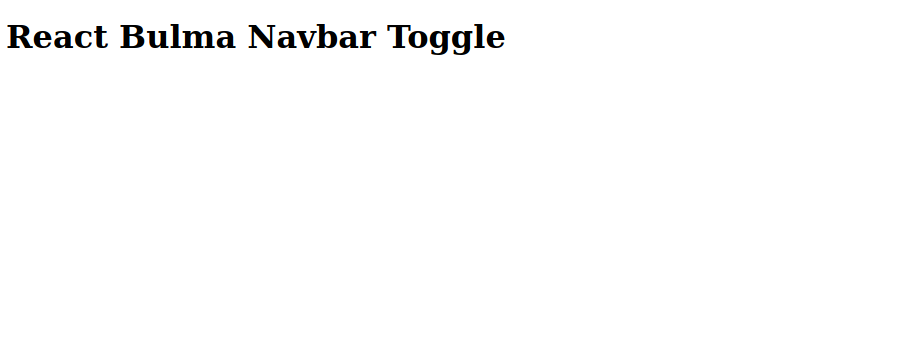

When starting a new project, the styling we use is often one of the first considerations. I generally prefer to code my own SCSS, but often there in not time, and I reach for a CSS framework of some kind. I tend to prefer the utility systems like Tailwind or Bulma.

I enjoy using Bulma but it does not include Javascript actions for menu toggle. So, the developer is left to find a solution. This article is an example of a simple way to use React hooks as an way to toggle a Navbar menu.

TLTR: Jump straight to the [code][REPO] and try it out, and you can take a look at the deployed [Demo][SITE].

## Setup
We are doing to set up a basic React App. My personal preference is to use my **React Parcel Boilerplate** using Parcel as a bundler. You can read the two part tutorial [ARTICLE](https://www.eclecticsaddlebag.com/react-boilerplate-part-1/) or view the Code of my [Parcel Boilerplate][BOILERPLATE].

However, in this tutorial, we will use [Create React App][CRA], so we all are in a familiar environment to begin.

To start a new project with CRA, install as shown:

```shell script
yarn create react-app react-bulma-navbar
```
or
```shell script
npx create-react-app react-bulma-navbar
```

**Clean up CRA**

Next we are going to clean up the default setup. Delete the header section,`<header> ... </header>` from `App.js`, and replace with the following just to give us some content:
```html
<h1>React Bulma Navbar Toggle</h1>
```
Delete the following files and their associated import statements:

1. Delete `logo.svg` and the import statement in `App.js`
2. Delete `App.css` and the import statement in `App.js`
3. Delete `index.css` and the import statement in `App.js`

Congratulations! You are the proud owner of an ugly site.



## Add Bulma for Styling

Add Bulma to our project with `yarn add bulma` or `npm install --save bulma`. We will also need `node-sass` as a Dev dependency: `yarn add -D node-sass` or `npm install --save-dev node-sass`.

Create in the src directory a file for our custom styles `touch main.scss`, and in the new file, import `bulma`: `@import "~bulma/bulma";`. In `App.js` add an import for our stylesheet: `import 'main.scss'`

## Add Navbar
We are going to create a new functional component for our menu. As seen below, I have imported the default example from the Bulma web site, and trimmed some of the navigation out so we have just enough as an example:
```jsx
import React from 'react'

export default function Navbar() {
  
  return (
    <nav className='navbar' role='navigation' aria-label='main navigation'>
      <div className='navbar-brand'>
        <a href='/' className='navbar-item'>
          
        </a>

        <a
          role='button'
          className={'navbar-burger burger'}
          aria-label='menu'
          aria-expanded='false'
          data-target='navbarBasicExample'
        >
          <span aria-hidden='true'></span>
          <span aria-hidden='true'></span>
          <span aria-hidden='true'></span>
        </a>
      </div>
      <div id='navbarBasicExample' className='navbar-menu'>
        <div className='navbar-end'>
          <div className='navbar-item'>
            <a href='/' className='navbar-item'>
              Home
            </a>
            <a href='/' className='navbar-item'>
              Documentation
            </a>
          </div>
        </div>
      </div>
    </nav>
  )
}
```
Remember to add the import to `App.js`:

```javascript
import React from 'react'
import Navbar from './Navbar'
import './main.scss'

function App() {
  return (
    <div className='App'>
      <Navbar />
      <h1 className='container is-fluid'>React Bulma Navbar Toggle</h1>
    </div>
  )
}

export default App
```
If you start your development server it all will display nicely, but on the smaller screen sizes, the menu toggle does not work.

## Add Navbar Toggle

There are a few ways to handle an event to toggle the menu on a click event. In a plain HTML project we could us VanillaJS to create a click handler with `addEventListener()`, you can use JQuery, or you can use a pure CSS menu toggle.

In React there are a few options as well. You can create click handlers in a class Component. In our example, I have specifically chosen a functional component so we can utilize React Hooks.

So, first we need to create a custom Hook:

```javascript
export default function Navbar() {
  const [isActive, setisActive] = React.useState(false)

  return (
    ...
    )
}
```

Then add a click event to the Burger button, and ternary expressions to make the classes used dynamic and affected by the state. The new functional component looks like this:

```javascript
export default function Navbar() {
  const [isActive, setisActive] = React.useState(false)

  return (
    <nav className='navbar' role='navigation' aria-label='main navigation'>
      <div className='navbar-brand'>
        <a href='/' className='navbar-item'>
          
        </a>

        <a
          onClick={() => {
            setisActive(!isActive)
          }}
          role='button'
          className={`navbar-burger burger ${isActive ? 'is-active' : ''}`}
          aria-label='menu'
          aria-expanded='false'
          data-target='navbarBasicExample'
        >
          <span aria-hidden='true'></span>
          <span aria-hidden='true'></span>
          <span aria-hidden='true'></span>
        </a>
      </div>
      <div id='navbarBasicExample' className={`navbar-menu ${isActive ? 'is-active' : ''}`}>
        <div className='navbar-end'>
          <div className='navbar-item'>
            <a href='/' className='navbar-item'>
              Home
            </a>
            <a href='/' className='navbar-item'>
              Documentation
            </a>
          </div>
        </div>
      </div>
    </nav>
  )
}
````
What's next? Nothing you are done. When you click the menu toggle, the click handler, sets the state to the opposite of the current state. That is it.

Remember this is just the default example from Bulma. In a live site it would be helpful to use Link from React Router for the menu links, but this is a good basic start.


[REPO]: https://github.com/eclectic-coding/article_react-bulma-navbar
[SITE]: https://react-bulma-navbar.now.sh/
[BOILERPLATE]: https://github.com/eclectic-coding/react-parcel-boilerplate
[CRA]: https://reactjs.org/docs/create-a-new-react-app.html

